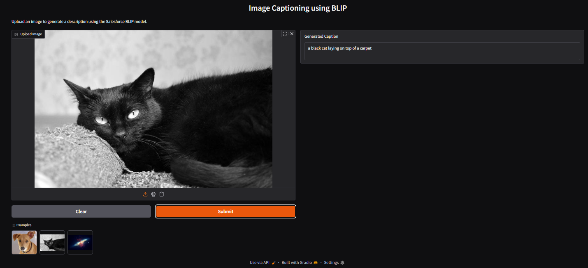

# 🖼️ Image Captioning with BLIP


A lightweight, **local image captioning application** that automatically generates descriptive captions for images using a pretrained vision–language model.

Built with Python, **Salesforce BLIP**, and **Gradio** for a clean, browser-based interface.

---

## 🖼️ App Demo Screenshot



---

## ✨ Features

* **Offline Capable:** Runs entirely on your machine after the initial model download.
* **No API Keys:** No Hugging Face token or external APIs required.
* **Simple UI:** Drag-and-drop image upload via Gradio.
* **Clean Output:** Suppresses unnecessary warnings and logs for a smoother experience.
* **CPU-Friendly:** Automatically uses CPU (or GPU if available and configured).

---

## 🛠️ Tech Stack

* **UI:** Gradio
* **Model:** [`Salesforce/blip-image-captioning-base`](https://huggingface.co/Salesforce/blip-image-captioning-base)
* **Task:** Image-to-Text (Image Captioning)
* **Framework:** PyTorch + Transformers

---

## 📦 Installation

### 1. Clone the Repository
```bash
git clone https://github.com/arman1o1/image-captioning-blip.git
cd image-captioning-blip
````

### 2. Install Dependencies

It is recommended to use a virtual environment.

```bash
pip install -r requirements.txt
```

---

## ▶️ Usage

Run the application locally:

```bash
python app.py
```

On first run, the model weights will be downloaded automatically (approximately 1 minute on CPU).

Once ready, the terminal will display a local URL:

```text
Running on local URL: http://127.0.0.1:7860
```

Open the link in your browser to start generating image captions.

---

## ⚙️ Technical Details

* **Model:** [Salesforce/blip-image-captioning-base](https://huggingface.co/Salesforce/blip-image-captioning-base)
* **Inference:** Uses the Hugging Face `pipeline` API for image-to-text generation
* **Execution:** Automatically selects CPU or GPU depending on availability
* **Caching:** Model weights are cached locally after the first run

---

## 📄 License

This project uses the **BLIP** model, which is licensed under the
**Creative Commons Attribution 4.0 International License (CC BY 4.0)**.
